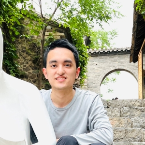

Hello! My name is Jingzhou Fu. 
I am a PhD student at the [Software System Security Assurance Group](http://wingtecher.com/homeen) in Tsinghua University, supervised by Professor [Yu Jiang](https://sites.google.com/site/jiangyu198964/home).
My research is focused on **DBMS fuzzing**.

Email: fjz22 at mails.tsinghua.edu.cn 

### Publications

- **Sequence-Oriented DBMS Fuzzing** (ICDE 2023) \
Jie Liang, Yaoguang Chen, Zhiyong Wu, **Jingzhou Fu**, Mingzhe Wang, Yu Jiang, Xiangdong Huang, Ting Chen, Jiashui Wang, Jiajia Li. ([paper](http://wingtecher.com/themes/WingTecherResearch/assets/papers/LEGO_ICDE2023.pdf))
- **Griffin: Grammar-Free DBMS Fuzzing** (ASE 2022) \
**Jingzhou Fu**, Jie Liang, Zhiyong Wu, Mingzhe Wang and Yu Jiang. ([paper](http://wingtecher.com/themes/WingTecherResearch/assets/papers/ASE22-Griffin.pdf))
